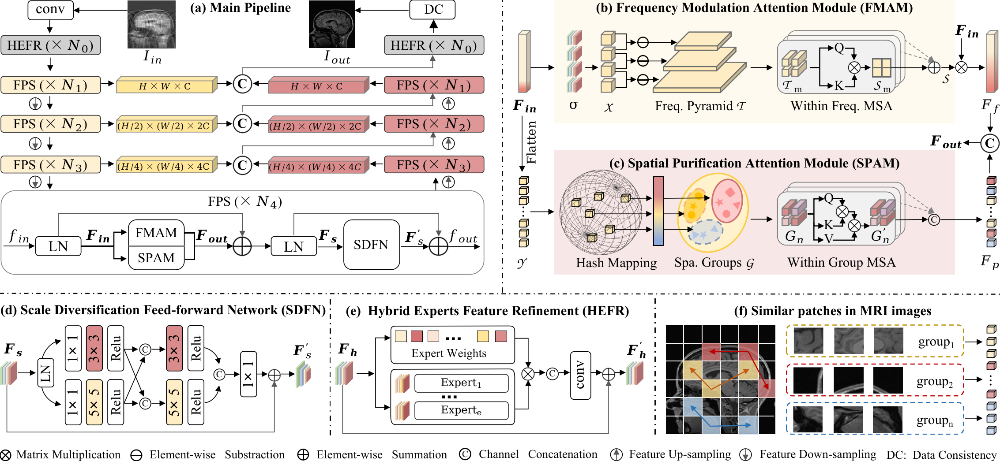
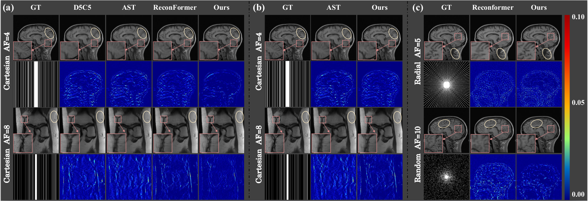
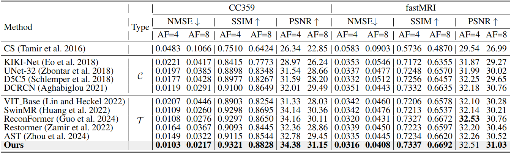

# [AAAI2025 Oral] Boosting ViT-based MRI Reconstruction from the Perspectives of  Frequency Modulation, Spatial Purification, and Scale Diversification [](https://arxiv.org/abs/2412.10776)

ViTs in MRI reconstruction struggle with high-frequency information loss, irrelevant token interactions, and limited multi-scale feature modeling. To tackle these issues, we propose FPS-Former, a powerful ViT-based framework for effective MRI reconstruction. 

## News

* **If you find this work helpful, please give us a :star2: to receive the updation !**
* **` Dec. 10th, 2024`:** FPS-Former is accepted by AAAI2025.
* **We are sorting the code** 🔥🔥🔥

## Overview

<p align="middle">

</p>

The accelerated MRI reconstruction process presents a challenging ill-posed inverse problem due to the extensive under-sampling in k-space. Recently, Vision Transformers (ViTs) have become the mainstream for this task, demonstrating substantial performance improvements. However, there are still three significant issues remain unaddressed: (1) ViTs struggle to capture high-frequency components of images, limiting their ability to detect local textures and edge information, thereby impeding MRI restoration; (2) Previous methods calculate multi-head self-attention (MSA) among both related and unrelated tokens in content, introducing noise and significantly increasing computational burden; (3) The naive feed-forward network in ViTs cannot model the multi-scale information that is important for image restoration. In this paper, we propose FPS-Former, a powerful ViT-based framework, to address these issues from the perspectives of frequency modulation, spatial purification, and scale diversification. Specifically, for issue (1), we introduce a frequency modulation attention module to enhance the self-attention map by adaptively re-calibrating the frequency information in a Laplacian pyramid. For issue (2), we customize a spatial purification attention module to capture interactions among closely related tokens, thereby reducing redundant or irrelevant feature representations. For issue (3), we propose an efficient feed-forward network based on a hybrid-scale fusion strategy. Comprehensive experiments conducted on three public datasets show that our FPS-Former outperforms state-of-the-art methods while requiring lower computational costs.

## Data Preparation

Prepare the dataset in the following structure for easy use of the code.The provided data loaders is ready for this this format and you may change it as your need.

```bash


                   |-- 
                   |                       
                   |                |--xxx.h5  
Dataset Folder-----|      |--train--|...
                   |      |         |...
                   |      |                  
                   |      |         
                   |--PD -|
                          |
                          |         |--xxx.h5 
                          |-- val --|...  
                                    |...
 ```

### Links for downloading the public datasets:

1) CC359 Dataset - <a href="https://sites.google.com/view/calgary-campinas-dataset/download"> Link </a>
1) fastMRI Dataset - <a href="https://fastmri.med.nyu.edu/"> Link </a>
2) SKMTEA Dataset - <a href="https://stanfordaimi.azurewebsites.net/datasets/4aaeafb9-c6e6-4e3c-9188-3aaaf0e0a9e7"> Link </a>


## Requirement

python=3.6  
pytorch=1.7.0

## Main Results

#### 1. Qualitative comparison.

<p align="middle">

</p>

#### 2. Comparison with State-of-the-arts
<p align="middle">

</p>

## Citation 
Please cite our work if you find it helpful to your reseach. :two_hearts:
```bash
@article{meng2024boosting,
  title={Boosting ViT-based MRI Reconstruction from the Perspectives of Frequency Modulation, Spatial Purification, and Scale Diversification},
  author={Meng, Yucong and Yang, Zhiwei and Shi, Yonghong and Song, Zhijian},
  journal={arXiv preprint arXiv:2412.10776},
  year={2024}
}
```
If you have any questions, please feel free to contact the author by ycmeng21@m.fudan.edu.cn.

## Acknowledgement
This repo is built upon [fastMRI](https://github.com/facebookresearch/fastMRI) and [ReconFormer](https://github.com/guopengf/ReconFormer). Many thanks to their brilliant works!!!
